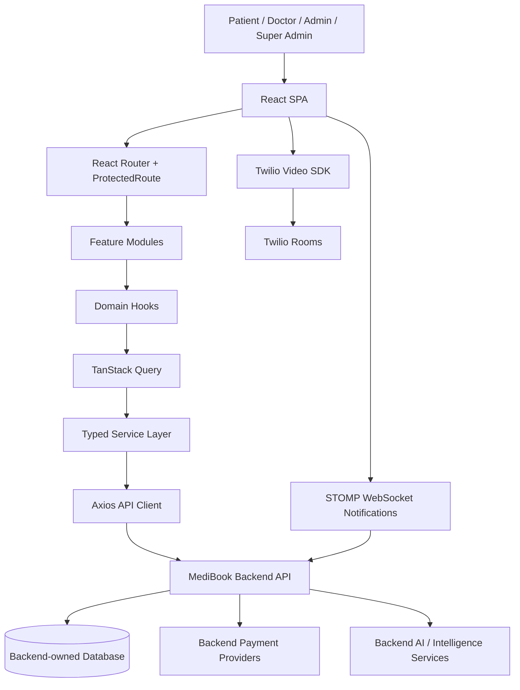

# MediBook Frontend

Healthcare appointment booking, telemedicine, clinical workflow, and administration portal built with React, TypeScript, and Vite.

## Overview

MediBook is the frontend application for a multi-role healthcare platform. It gives patients a guided way to find doctors, reserve appointment slots, pay for consultations, join telemedicine sessions, review prescriptions, and manage their medical profile. Doctors use the platform to manage schedules, appointments, notes, prescriptions, leave, notifications, and live consultations. Administrators use the desktop portal to manage departments, doctors, users, analytics, capacity, deleted records, and super-admin workflows.

This repository contains the browser client only. It communicates with a backend REST and WebSocket API, with all database, payment-webhook, identity, and clinical data persistence handled by backend services outside this repo.

## Key Features

- Public landing, contact, terms, and privacy pages.
- Patient authentication, registration, email verification, password reset, and optional 2FA verification.
- Role-based portals for `patient`, `doctor`, `admin`, and `super_admin`.
- Patient doctor discovery by search, departments, specialisations, availability, and doctor profile detail.
- Appointment booking with temporary slot holds, hold expiry tracking, confirmation, cancellation, rescheduling, recurring appointments, waitlist, and calendar export support.
- Payment initiation, provider discovery, verification, refunds, invoices, and post-payment verification flow.
- Patient profile, clinical profile, consents, consultation history, prescriptions, notifications, access grants, and emergency request workflows.
- Doctor dashboard, schedule, working hours, appointment details, SOAP-style consultation notes, prescriptions, leave management, profile, settings, and notifications.
- Telemedicine session management with chat, session status transitions, Twilio-powered video calls, call note drafts, and doctor copilot route.
- Real-time notification support through STOMP over WebSocket with polling fallback for unread counts.
- Admin desktop portal for patients, departments, doctors, doctor performance, leaves, schedules, analytics, capacity, settings, soft-deleted records, and super-admin account management.
- AI-assisted surfaces through backend endpoints for chat, clinical copilot, symptom triage, and no-show risk prediction. These are presented as assistive/stubbed outputs where the code marks them as requiring clinical review.
- Frontend security controls for role guards, session timeout, request sanitization helpers, safe HTML rendering, error boundaries, and PHI-aware logging utilities.

## Tech Stack

| Area | Technologies |
| --- | --- |
| Frontend | React 19, TypeScript 6, Vite 8, React Router DOM 7 |
| State and data fetching | TanStack Query 5, Zustand 5 |
| API layer | Axios, typed service modules, Zod environment validation |
| Realtime | `@stomp/stompjs` over WebSocket, unread notification polling fallback |
| Video | Twilio Video, lazy-loaded only when a call starts |
| Forms and validation | Local form primitives, custom validation helpers, Zod for runtime env parsing |
| UI system | CSS design tokens, reusable primitives, responsive mobile and desktop shells |
| Security helpers | DOMPurify, safe HTML component, PHI-redacting logger, protected routes, idle timeout |
| Testing | Vitest, React Testing Library, MSW, Playwright |
| DevOps | Docker multi-stage build, Nginx runtime, GitHub Actions CI, Trivy image scanning, Google Cloud Build, Artifact Registry, Cloud Run deployment |
| Backend | External MediBook API consumed over `/api/v1`, `/health`, `/version`, `/contact`, and `/ws` |
| Database/cache/queue | Not present in this frontend repo; backend-owned |
| Observability | Global error boundary, structured logger placeholder, Nginx health endpoint, CI security scan |

## Architecture

MediBook is a single-page application organized by feature domain. The UI routes are lazy-loaded from `src/App.tsx`, wrapped by global providers in `src/main.tsx`, and protected by a role-aware route guard. Data access is centralized through a configured Axios client and feature-specific service modules. React Query owns server-state caching, mutation invalidation, retry behavior, and polling. Zustand owns client state such as auth, notifications, assistant state, and active video-call state.



### Frontend Data Flow

1. A user enters a route in `src/App.tsx`.
2. `ProtectedRoute` verifies authentication status and allowed roles.
3. The page component calls a domain hook or service.
4. React Query coordinates loading, caching, retries, and invalidation.
5. Axios sends the request to the configured backend base URL.
6. The response interceptor handles 401 responses with a single refresh-token rotation flow, retries the original request, or dispatches logout/access-denied events.
7. Feature stores update only browser-local UI state; durable business data remains backend-owned.

### Auth and Authorization

- Login, registration, 2FA verification, refresh, logout, reset password, and email verification are implemented in `src/services/auth.service.ts`.
- Routes are guarded by `src/components/auth/ProtectedRoute.tsx`.
- Roles are normalized from backend roles such as `ROLE_PATIENT`, `ROLE_DOCTOR`, `ROLE_ADMIN`, and `ROLE_SUPER_ADMIN`.
- Access tokens are held in Zustand state and attached as Bearer tokens by the Axios request interceptor.
- Refresh-token rotation is handled by the Axios response interceptor with a single in-flight refresh queue to prevent parallel refresh races.
- The current implementation persists only `refreshToken` through Zustand `persist` under the `medibook-auth` key. The security docs describe an HTTP-only-cookie target architecture, so treat the current localStorage persistence as an implementation detail to review before handling production PHI.
- A 15-minute inactivity timeout logs out authenticated users.

### Realtime and Async Behavior

- Notifications connect to `/ws?token=...` using STOMP and subscribe to `/user/queue/notifications`.
- WebSocket reconnects use exponential backoff and re-read the latest access token before reconnecting.
- Unread notification counts are polled every 30 seconds as a fallback.
- Booking uses backend slot holds through `POST /api/v1/appointments/holds`, tracks hold expiration client-side, releases holds when cancelled, and invalidates appointment and availability queries after confirmation.
- Telemedicine video calls lazy-load `twilio-video`, request call tokens from the backend, and manage local/remote participant tracks in `src/store/videoCallStore.ts`.

## Project Structure

```text
.
├── .github/workflows/ci.yml        # lint, typecheck, tests, Docker build, Trivy scan, Cloud Run deploy
├── Dockerfile                      # Node 22 build stage + Nginx runtime
├── cloudbuild.yaml                 # Google Cloud Build image build
├── nginx.conf                      # SPA runtime, security headers, gzip, health check
├── e2e/                            # Playwright end-to-end tests
├── public/                         # favicons, manifest, static doctor avatars
├── src/
│   ├── api/                        # compatibility exports around service/http layers
│   ├── components/                 # primitives, forms, layout, feedback, auth, table, canvas
│   ├── config/                     # typed environment configuration
│   ├── constants/                  # design tokens
│   ├── features/                   # landing, auth, patient, doctor, admin, shared, legal, onboarding
│   ├── hooks/                      # React Query and domain hooks
│   ├── lib/                        # API client/contracts, validation, logging, sanitization, dates
│   ├── providers/                  # auth and realtime providers
│   ├── services/                   # backend API service modules
│   ├── store/                      # Zustand stores
│   ├── styles/                     # global design system CSS
│   ├── test/                       # Vitest/MSW setup
│   └── types/                      # API and domain types
├── vite.config.ts
├── vitest.config.ts
├── playwright.config.ts
└── package.json
```

## Application Routes

| Area | Routes |
| --- | --- |
| Public | `/`, `/login`, `/register`, `/forgot-password`, `/reset-password`, `/verify-email`, `/terms`, `/privacy`, `/unauthorized` |
| Patient | `/patient/search`, `/patient/doctor/:id`, `/patient/book/review`, `/patient/pay/:appointmentId`, `/patient/appts`, `/patient/appt/:id`, `/patient/prescriptions`, `/patient/history`, `/patient/invoices`, `/patient/notifications`, `/patient/profile`, `/patient/waitlist`, `/patient/recurring`, `/patient/emergency`, `/patient/telemedicine/:sessionId`, `/patient/chat/:conversationId` |
| Doctor | `/doctor/dashboard`, `/doctor/notifications`, `/doctor/settings`, `/doctor/schedule`, `/doctor/appt/:id`, `/doctor/appt/:id/note`, `/doctor/appt/:id/prescriptions`, `/doctor/hours`, `/doctor/profile`, `/doctor/leave`, `/doctor/telemedicine/:sessionId`, `/doctor/telemedicine/:sessionId/copilot`, `/doctor/chat/:conversationId` |
| Admin | `/admin/overview`, `/admin/patients`, `/admin/depts`, `/admin/docs`, `/admin/performance`, `/admin/leaves`, `/admin/schedule`, `/admin/analytics`, `/admin/capacity`, `/admin/settings`, `/admin/deleted-records` |
| Super Admin | `/admin/admins` |

## API Surface

The frontend consumes a broad backend API through service modules in `src/services`.

| Service | Responsibility |
| --- | --- |
| `auth.service.ts` | Login, register, 2FA, token refresh, logout, password reset, email verification, current user |
| `booking.service.ts` / `appointments.service.ts` | Holds, appointment creation, recurring bookings, cancellation, rescheduling, cursor pagination, ICS export |
| `doctor.service.ts` / `doctor-portal.service.ts` | Doctor search, details, availability, schedule, hours, leave, appointment transitions, note templates |
| `admin.service.ts` / `superadmin.service.ts` | Departments, users, doctors, analytics, capacity, pricing, admins, health/version |
| `telemedicine.service.ts` / `chat.service.ts` | Telemedicine sessions, chat messages, AI chat assist, call notes, video-call lifecycle |
| `consultation-notes.service.ts` / `prescriptions.service.ts` | Clinical notes, patient history, prescriptions |
| `payments.service.ts` | Payment initiation, verification, refunds, provider discovery, payment history |
| `notification.service.ts` | Notifications, unread counts, mark read/read-all |
| `patient-profile.service.ts` / `consents.service.ts` / `access-grant.service.ts` | Patient profile, consents, access grants and requests |
| `waitlist.service.ts` / `emergency.service.ts` / `reviews.service.ts` | Waitlist, emergency requests, reviews and moderation |
| `intelligence.service.ts` / `copilot.service.ts` / `aiChat.service.ts` | Symptom triage, no-show risk, doctor copilot, AI chat |
| `system.service.ts` / `contact.service.ts` / `lookups.service.ts` | Health, version, contact form, lookup metadata |

See `API_COVERAGE_REPORT.md` for the repository's detailed endpoint coverage notes.

## Environment Variables

Vite exposes only variables prefixed with `VITE_` to the browser bundle.

| Variable | Default | Required | Description |
| --- | --- | --- | --- |
| `VITE_API_URL` | `""` in code, `http://localhost:8080` in `.env.example` | Yes | Backend API origin. In local dev, Vite also proxies `/api` to this target. |
| `VITE_API_TIMEOUT_MS` | `15000` | No | Axios request timeout in milliseconds. Used by `src/config/env.ts`. |
| `VITE_ENV` | `development` | No | Runtime environment: `development`, `production`, or `test`. |
| `VITE_APP_NAME` | `MediBook` | No | Display name used by app configuration. |

Create a local env file from the example:

```bash
cp .env.example .env.local
```

Example:

```bash
VITE_API_URL=http://localhost:8080
VITE_API_TIMEOUT_MS=15000
VITE_ENV=development
VITE_APP_NAME=MediBook
```

Note: the checked-in `.env` includes `VITE_API_BASE_URL`, but the current `src/config/env.ts` schema does not consume it.

## Getting Started

### Prerequisites

- Node.js 22, matching the Dockerfile and GitHub Actions workflow.
- npm, using the committed `package-lock.json`.
- A running MediBook backend API, or MSW/test mocks for test execution.

### Install

```bash
npm ci
```

### Run Locally

```bash
npm run dev
```

The Vite dev server runs on:

```text
http://localhost:3000
```

During local development, Vite proxies `/api` requests to `VITE_API_URL`.

### Build

```bash
npm run build
```

The production bundle is emitted to `dist/`.

### Preview Production Build

```bash
npm run preview
```

## Scripts

| Command | Description |
| --- | --- |
| `npm run dev` | Start the Vite dev server on port 3000. |
| `npm run build` | TypeScript project build plus Vite production build. |
| `npm run lint` | Run ESLint over the repo. |
| `npm run preview` | Serve the built Vite app locally. |
| `npm run test` | Run Vitest in watch mode. |
| `npm run test:ui` | Run Vitest UI. |
| `npm run test:run` | Run Vitest once for CI. |
| `npm run test:e2e` | Run Playwright tests. |
| `npm run test:e2e:ui` | Run Playwright UI. |

## Testing

Unit and integration tests live beside feature, hook, component, and service code under `__tests__` folders. MSW handlers are configured in `src/test/handlers.ts`, `src/test/server.ts`, and `src/test/setup.ts`.

```bash
npm run test:run
```

End-to-end tests live in `e2e/` and are configured for Chromium desktop plus WebKit iPhone 14.

```bash
npm run test:e2e
```

The Playwright config starts `npm run dev` automatically and targets `http://localhost:3000`.

## Docker

Build the container:

```bash
docker build \
  --build-arg VITE_API_URL=https://api.dreammedibook.com \
  --build-arg VITE_ENV=production \
  --build-arg VITE_APP_NAME=MediBook \
  -t medibook-fe .
```

Run it:

```bash
docker run --rm -p 8080:8080 medibook-fe
```

The runtime image:

- Builds with `node:22-alpine`.
- Serves the static bundle with `nginx:1.27-alpine`.
- Runs Nginx as the `nginx` user on port `8080`.
- Exposes `/health`.
- Adds security headers, gzip, immutable asset caching, and SPA fallback routing.

## CI/CD and Deployment

GitHub Actions workflow: `.github/workflows/ci.yml`

- Runs lint and TypeScript checks.
- Runs Vitest.
- Builds the Docker image.
- Pushes to Google Artifact Registry on push events.
- Runs Trivy image scanning for high and critical vulnerabilities.
- Deploys `master` to Cloud Run.
- Performs a live smoke check and rolls back traffic to the previous Cloud Run revision if the smoke check fails.

Google Cloud Build config: `cloudbuild.yaml`

- Builds the frontend image with `VITE_API_URL=https://api.dreammedibook.com`.
- Publishes `us-central1-docker.pkg.dev/$PROJECT_ID/medibook-repo/medibook-fe:latest`.

## Security and Compliance Notes

- `ProtectedRoute` enforces role-based access at the routing layer.
- Axios interceptors centralize Bearer-token attachment, refresh handling, access-denied events, and session-expired behavior.
- `useIdleTimeout` logs users out after 15 minutes of inactivity.
- `SafeHtml` and `sanitize.ts` use DOMPurify to reduce XSS risk when rendering user-provided content.
- `logger.ts` redacts common PHI fields before writing logs.
- `GlobalErrorBoundary` prevents uncaught React errors from blanking the app and is prepared for Sentry/LogRocket-style reporting.
- Nginx sets frame, content-type, referrer, permissions, and CSP headers in the container runtime.
- The frontend does not include database, cache, queue, or backend authorization enforcement. Those must be enforced server-side.

## Known Limitations and Assumptions

- This repo is frontend-only. Backend services, database migrations, queues, cache, payment webhooks, FHIR endpoints, and clinical authorization enforcement are not included.
- `SECURITY_GUIDELINES.md` describes refresh tokens as HTTP-only-cookie managed, but the current auth store persists `refreshToken` via Zustand localStorage persistence. Review this before production PHI handling.
- `GlobalErrorBoundary` contains a TODO for sending production errors to an external monitoring provider.
- `contact.service.ts` notes that the backend contact endpoint still needs implementation before that service is relied on.
- `VITE_API_TIMEOUT_MS` is consumed by code but is not listed in `.env.example`; add it locally when overriding the default.
- `VITE_API_BASE_URL` appears in the checked-in `.env` but is not used by the current environment schema.
- The repository includes generated/build artifacts such as `dist/`, `playwright-report/`, and `test-results/`; normal development should treat them as disposable outputs.

## Additional Documentation

- `API_COVERAGE_REPORT.md` — endpoint coverage matrix and feature mapping.
- `FRONTEND_BACKEND_GAPS.md` — integration gap history and resolved items.
- `SECURITY_GUIDELINES.md` — security and PHI-handling guidance.
- `Endpoints.md` — architecture and API planning notes.
